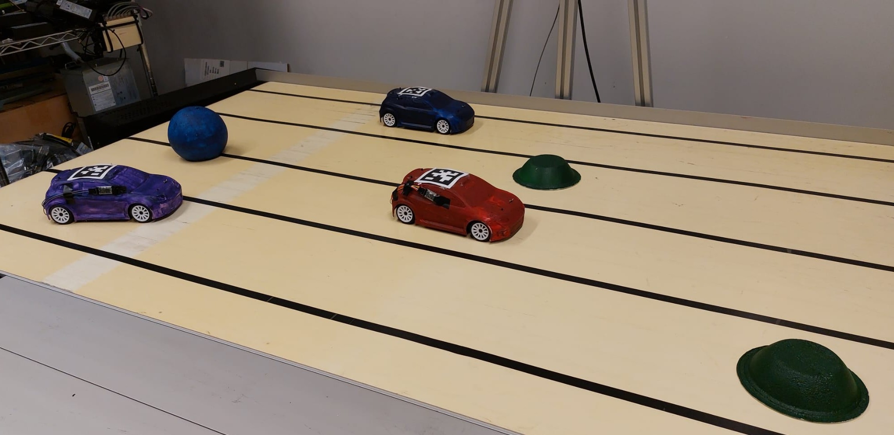
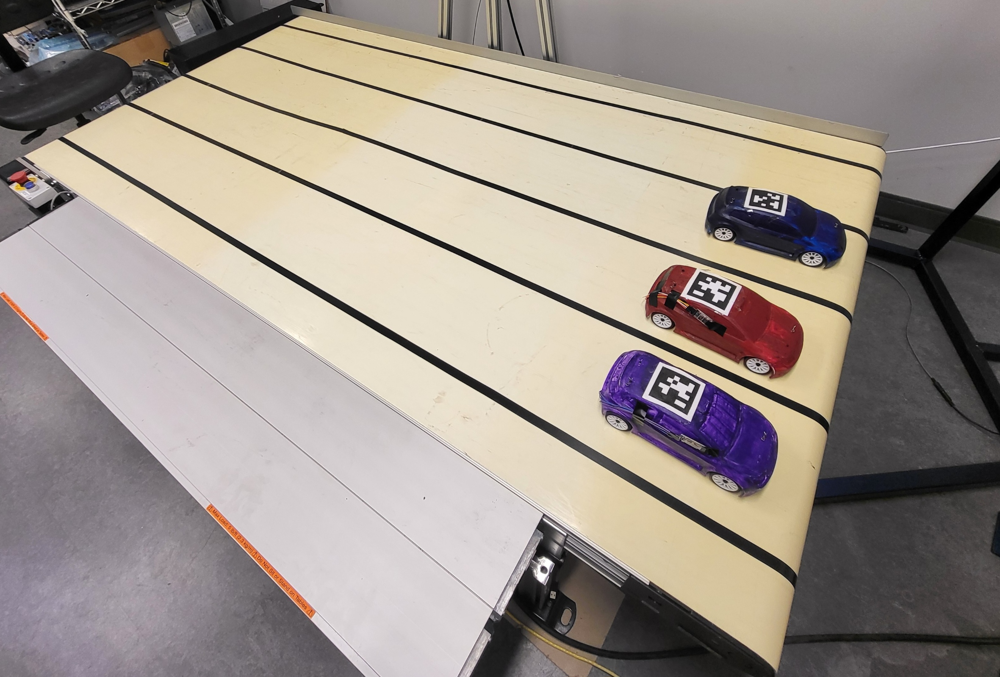

# ADAS-on-Treadmill-2024

## The project
The University of Waterloo’s Real-time Embedded Systems Lab hosts an autonomous driving system operating radio-controlled (RC) cars on a treadmill. The aim of this project is to simulate Advanced Driver-Assistance Systems on RC cars. The cars move on a treadmill. A camera is placed above the system to detect both the position of the vehicles and obstacles. Obstacles can be studs, which move only on one axis, or balls. The cars maintain a position on the treadmill until an obstacle is detected. They must then move to avoid it. 



Information from the camera is received on a PC and processed by ROS 2, before being transmitted to the cars via Bluetooth.  
We use ROS2 Humble with ubuntu 22.04

## How to launch
### Hardware

Place the cars at the front of the conveyor belt, at the edge of the empty space, with the batteries connected.  
Check that the camera is connected.



### Software

Oh to launch car controller:
```
cd ADAS-on-Treadmill-2024
cd ros2_jf_waterloo
source install/setup.bash
colcon build
cd launch
ros2 launch <launch_file>
```
Remember to check that each car is connected. (This is noted in the terminal and the Bluetooth modules flash intermittently).  

To launch the treadmill: use treadmill_control.py.  
Run the program, a window opens, you choose the speed and click on start.  
If nothing happens, set the enp9s0 Ethernet link to profile 2 with IP 192.168.124.1. 

# Package

## Nodes

### controller_node
- **Description**: The main node responsible for defining commands for the car. It allows changing algorithms to test different car behaviors.

### camera_node
- **Description**: This node captures images from the camera and provides the position of the cars and obstacles.

### camera_with_apriltags_node
- **Description**: This node captures images from the camera and provides the position of the cars and obstacles with apriltags to separate the cars.

### bluetooth_node
- **Description**: This node sends commands to the car via Bluetooth.

### input_node
- **Description**: This node receives user inputs to change the car's position.

### display_node
- **Description**: This node displays the position of the cars and obstacles.

### avoiding_obstacles_node
- **Description**: This node defines input positions to avoid obstacles.

### treadmill_control_node
- **Description**: This node controls the treadmill.

### security_node
- **Description**: This node detects anomalies.

### save_topic
- **Description**: This node saves data in several topics in a CSV file.

## Topics

To allow communication between these nodes, several topics are used:

### /car_position
- **Type**: Int32 list
- **Description**: List of car positions and their dimensions.
- **Format**: `[id_1, x_1, y_1, \theta_1, height_1, width_1, id_2, x_2, y_2, \theta_2, height_2, width_2, ...]`

### /input_position
- **Type**: Int32 list
- **Description**: User input positions.
- **Format**: `[id_1, X_input1, Y_input1, id_2, X_input2, Y_input2, ...]`

### /command
- **Type**: Int32 list
- **Description**: Speed and angle commands for the car.
- **Format**: `[id_1, speed_1, angle_1, id_2, speed_2, angle_2, ...]`

### /obstacles_position
- **Type**: Int32 list
- **Description**: Position of obstacles.
- **Format**: `[x_1, y_1, radius_1, x_2, y_2, radius_2, ...]`

### /error
- **Type**: String
- **Description**: Error messages.

### /treadmill
- **Type**: String
- **Description**: Commands for the treadmill.


## Launch files:
- **ADAS_on_treadmill_launch**: one car go to the position that you define.
- **ADAS_on_treadmill_launch_with_obstacles**: one car avoid obstacles.
- **ADAS_on_treadmill_launch_several_cars**: the car avoid obstacles for several cars. Works for one car
- **ADAS_on_treadmill_launch_road**: highway simulation with lane change

